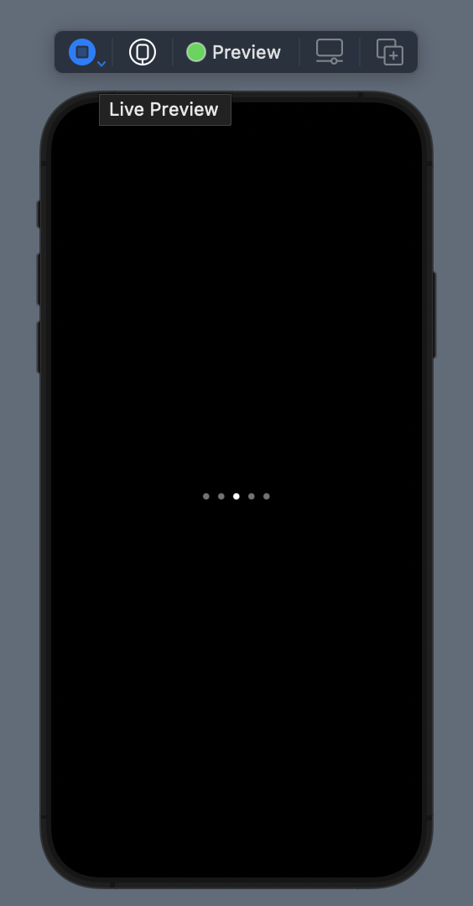
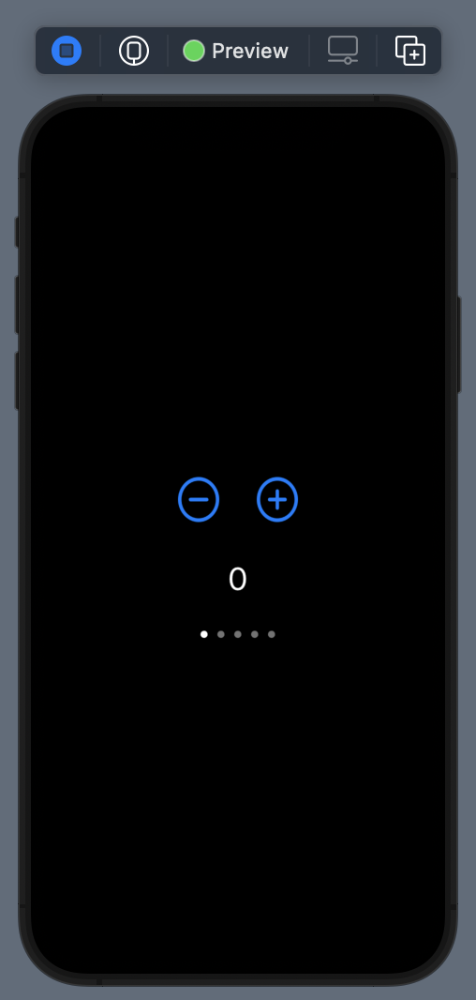

== Interfacing with the UIKit

=== UIViewRepresentable

Described in

* https://developer.apple.com/tutorials/swiftui/interfacing-with-uikit[Interfacing with UIKit]

link:./InterfacingWithUIKitDemo/InterfacingWithUIKitDemo/PageControl.swift[PageControl.swift]

[source]
----
include::./InterfacingWithUIKitDemo/InterfacingWithUIKitDemo/PageControl.swift[lines=6..30]
----

<1> We declare a binding for current page number as `currentPage`.
<2> Whenever the binding variable, `currentPage` is changed, `updateUIView` is invoked to update the UIView.

link:./InterfacingWithUIKitDemo/InterfacingWithUIKitDemo/PageControl1Demo.swift[PageControlDemo.swift]

When we click the plus/minus button, the page control would change responsively due to binding.

However, when we click the circle on the page control, the number won't change responsively.

==== Make UIKit Change back to SwiftUI Components

Described in

* https://developer.apple.com/documentation/swiftui/uiviewcontrollerrepresentable/makecoordinator()-32trb[makeCoordinator()]
* https://developer.apple.com/tutorials/swiftui/interfacing-with-uikit[Interfacing with UIKit Section4]

link:./InterfacingWithUIKitDemo/InterfacingWithUIKitDemo/PageControl.swift[PageControl2.swift]

[source]
----
include::./InterfacingWithUIKitDemo/InterfacingWithUIKitDemo/PageControl.swift[lines=6..45]
----

<1> We can use `typealias` for `UIPageControl` for clear naming.

<2> Create a `Coordinator` type for later use. `Coordinator` is used if you want to feedback changes in other UI type systems back to SwiftUI.

<3> The callback is prepared to be called when there is value change by our UIKit view. We will register it soon after.

<4> We implement `makeCoordinator()` of the protocol `UIViewRepresentable` and it would be called before `makeUIView()`

<5> Use `addTarget` to register callback.

Now we would observe the number change when we click different circles of the page control view.

=== UIViewControllerRepresentable

==== Phase 1: Render the View

Described in

* https://developer.apple.com/tutorials/swiftui/interfacing-with-uikit[Interfacing with UIKit Section 1]

link:./InterfacingWithUIKitDemo/InterfacingWithUIKitDemo/PageViewController1.swift[PageViewController1.swift]

[source]
----
include::./InterfacingWithUIKitDemo/InterfacingWithUIKitDemo/PageViewController1.swift[lines=4..30]
----

<1> We create a type alias for `UIPageViewController` as  `UIViewControllerType`
<2> As before, we need to define `makeUIViewController` and `updateUIViewController`, which would be called at initial phase and each time state change respectively.
<3> We pass our SwiftUI view of type `UIHostingController` by `setViewControllers` as type `UIPageViewController` (https://developer.apple.com/documentation/swiftui/uihostingcontroller[UIHostingController]: Create a `UIHostingController` object when you want to integrate SwiftUI views into a UIKit view hierarchy.)

At this phase we only render the view for `UIPageViewController` with `SwiftUI` views as its page views.

==== Phase 2: Add the data source

Described in

* https://developer.apple.com/tutorials/swiftui/interfacing-with-uikit[Interfacing with UIKit Section 2]

link:./InterfacingWithUIKitDemo/InterfacingWithUIKitDemo/PageViewController2.swift[PageViewController2.swift]

[source]
----
include::./InterfacingWithUIKitDemo/InterfacingWithUIKitDemo/PageViewController2.swift[lines=4..63]
----

<1> We need to define a `Coordinator` for `makeCoordinator` which would be called before `makeUIViewController`. https://developer.apple.com/documentation/swiftui/uiviewcontrollerrepresentable/makecoordinator()-32trb[makeCoordinator]
<2> We elaborate views inside our coordinator instead and the elaboration would be called only once since `makeCoordinator` would be only called once. Change `setViewControllers` to get views from coordinator.
<3> Make the coordinator implement `UIPageViewControllerDataSource`(i.e. `pageViewController` methods) for navigating before and after.
<4> Set coordinator as the data source of pageViewController.

At this phase, we can swipe the screen and the page view would be updated.

==== Phase 3: Add the data delegate

* https://developer.apple.com/tutorials/swiftui/interfacing-with-uikit[Interfacing with UIKit Section 3]

link:./InterfacingWithUIKitDemo/InterfacingWithUIKitDemo/PageViewController.swift[PageViewController.swift]

[source]
----
include::./InterfacingWithUIKitDemo/InterfacingWithUIKitDemo/PageViewController.swift[lines=4..27;59..75]
----

[source]
----
include::./InterfacingWithUIKitDemo/InterfacingWithUIKitDemo/PageViewController.swift[lines=77..89]
----

<1> We declare a binding variable in `PageViewController` and a state variable in parent view.
<2> In `updateUIViewController`, whenever there is state change, `setViewControllers` would set the UIPageViewController to current page based on the binding variable.
<3> Make `Coordinator` implement `UIPageViewControllerDelegate`. In `pageViewController`, we find index of current view and update it to the binding variable after transition completion.
<4> Assign coordinator as the delegate of the `UIPageViewController`

The full example combines:

* UIPageControl
* UIPageViewController

can be found in link:./InterfacingWithUIKitDemo/InterfacingWithUIKitDemo/ContentView.swift[ContentView.swift]

[source]
----
include::./InterfacingWithUIKitDemo/InterfacingWithUIKitDemo/ContentView.swift[lines=3..19]
----

