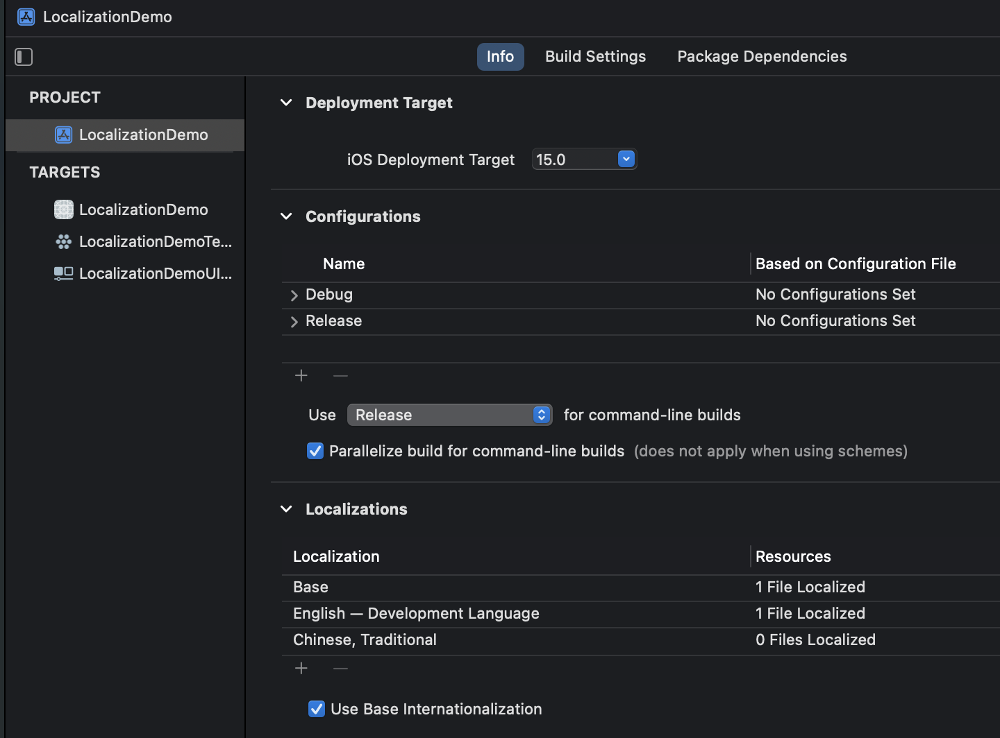
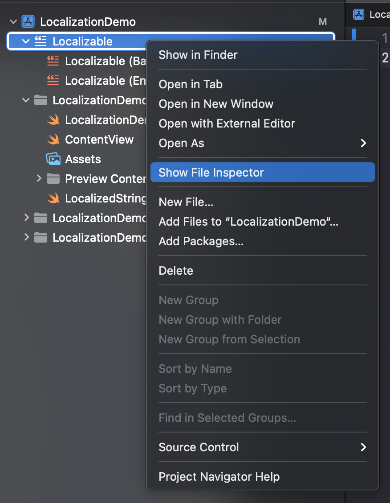
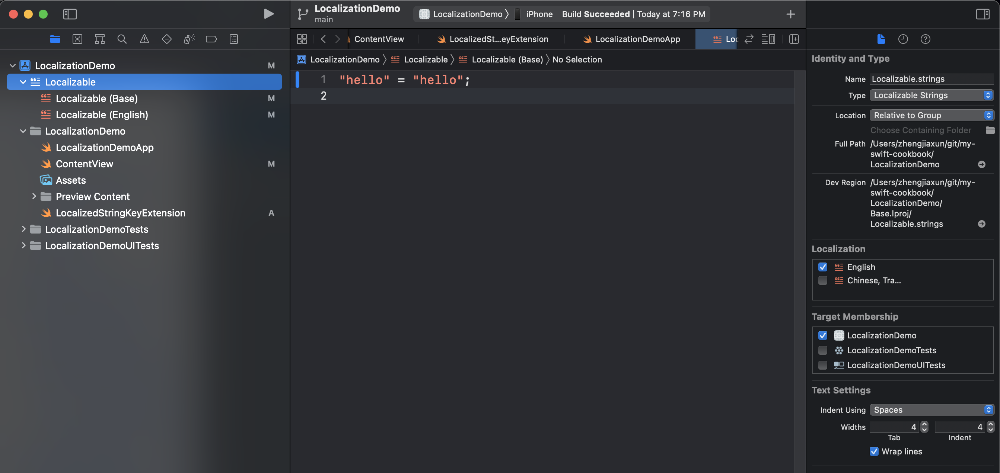
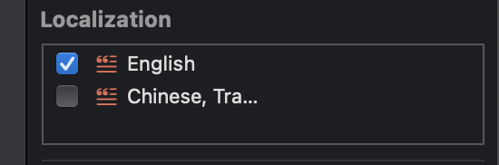
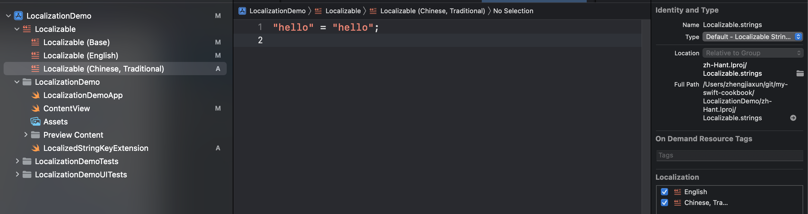

== Localization

Under `info` `Localizations`

* Click `+` to add languages
* Please toggle `Use Base Internationalization` on

* Check the language that you want to add localizations

link:./LocalizationDemo/en.lproj/Localizable.strings[LocalizationDemo/en.lproj/Localizable.strings]

[source]
----
include::LocalizationDemo/en.lproj/Localizable.strings[lines=1..2]
----

link:./LocalizationDemo/zh-Hant.lproj/Localizable.strings[LocalizationDemo/zh-Hant.lproj/Localizable.strings]

[source]
----
include::LocalizationDemo/zh-Hant.lproj/Localizable.strings[lines=1..2]
----

link:./LocalizationDemo/ja.lproj/Localizable.strings[LocalizationDemo/ja.lproj/Localizable.strings]

[source]
----
include::LocalizationDemo/ja.lproj/Localizable.strings[lines=1..2]
----

link:./LocalizationDemo/LocalizationDemo/ContentView.swift[LocalizationDemo/LocalizationDemo/ContentView.swift]

[source]
----
include::LocalizationDemo/LocalizationDemo/ContentView.swift[lines=3..33]
----

link:./LocalizationDemo/LocalizationDemo/LocalizationDemoApp.swift[LocalizationDemo/LocalizationDemo/LocalizationDemoApp.swift]

[source]
----
include::LocalizationDemo/LocalizationDemo/LocalizationDemoApp.swift[lines=4..12]
----

=== LocalizedStringKey Extension

Described in

* https://stackoverflow.com/questions/60841915/how-to-change-localizedstringkey-to-string-in-swiftui[Stackoverflow]

link:./LocalizationDemo/LocalizationDemo/LocalizedStringKeyExtension.swift[LocalizationDemo/LocalizationDemo/LocalizedStringKeyExtension.swift]

[source]
----
include::LocalizationDemo/LocalizationDemo/LocalizedStringKeyExtension.swift[lines=2..51]
----

link:./LocalizationDemo/LocalizationDemoTests/LocalizationDemoTests.swift[LocalizationDemo/LocalizationDemoTests/LocalizationDemoTests.swift]

[source]
----
include::LocalizationDemo/LocalizationDemoTests/LocalizationDemoTests.swift[lines=15..20]
----