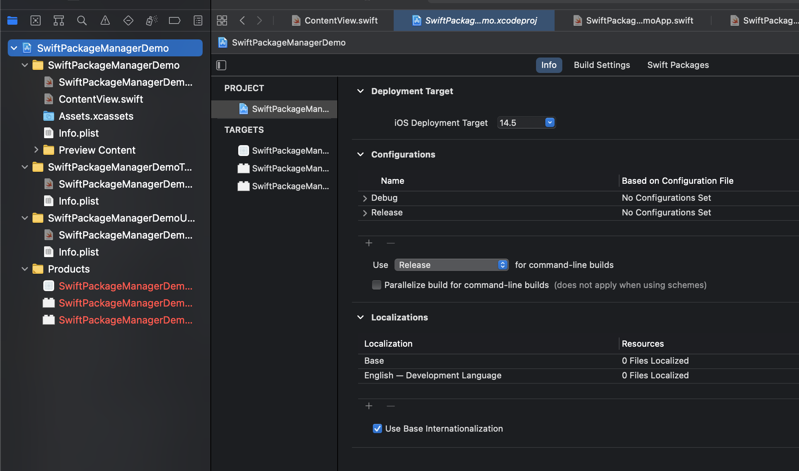
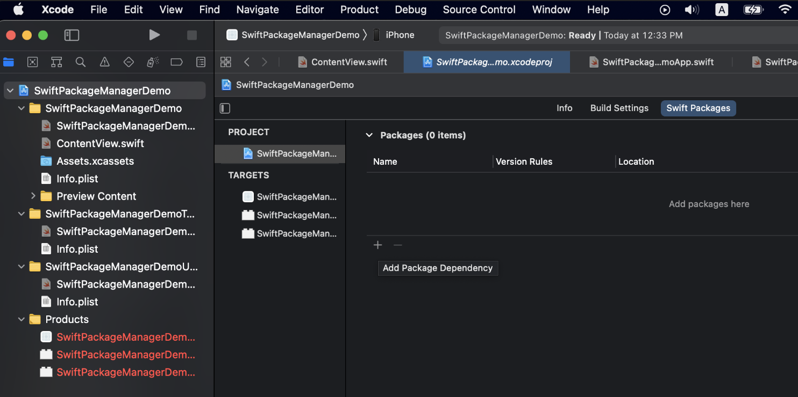
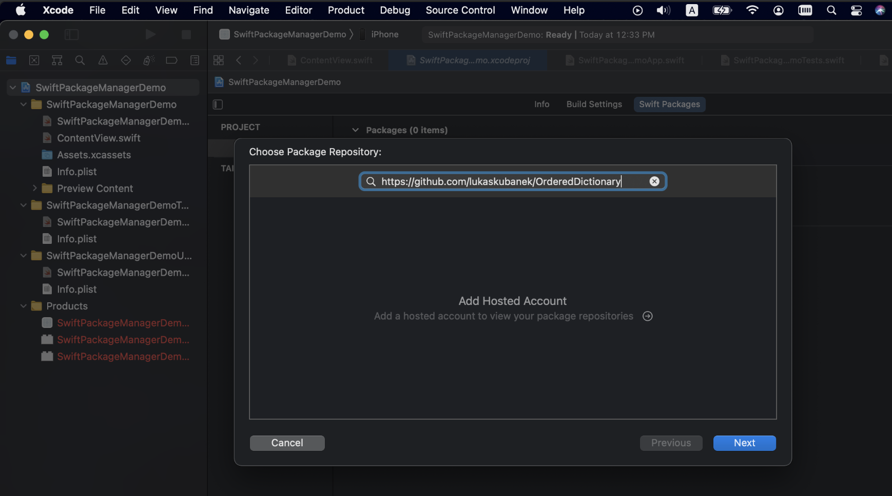
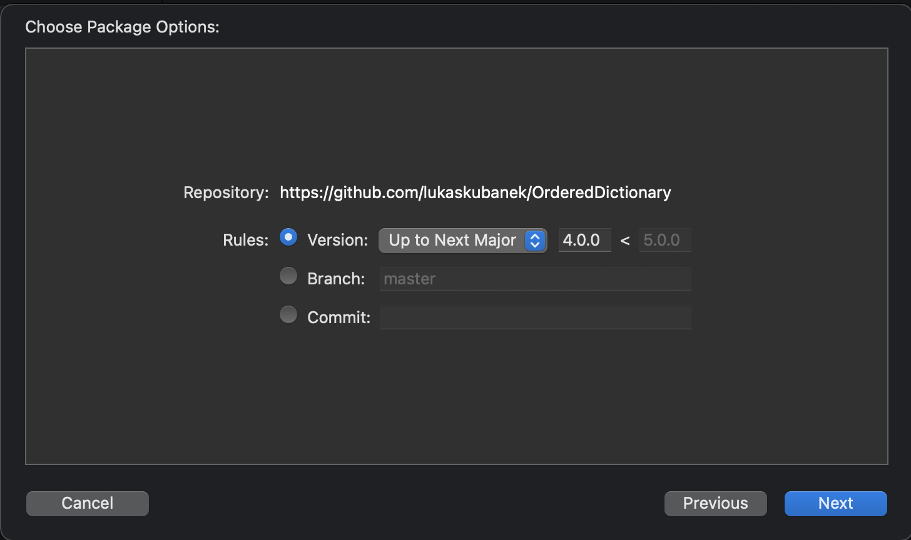
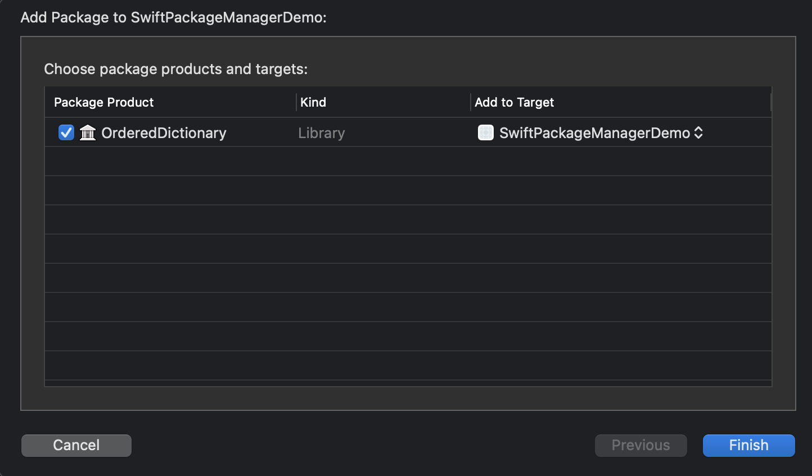

== Swift Package Manager

=== Add module dependency in Xcode

* Click your project name at the left panel (e.g. `SwiftPackageManagerDemo`)

* Click `SwiftPackageManagerDemo` under `PROJECT` at the middle panel
* Click `Swift Packages` at the top-right corner
* Click `+` to add package dependency

* Add your module dependency, we use `https://github.com/lukaskubanek/OrderedDictionary` as an example.

link:./SwiftPackageManagerDemo[SwiftPackageManagerDemo]

[source]
----
include::SwiftPackageManagerDemo/SwiftPackageManagerDemo/ContentView.swift[lines=1..13]
----

<1> Add `import` for your library
<2> The sample usage for this library

