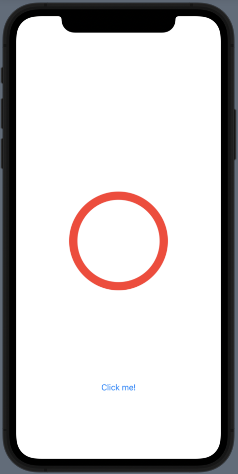
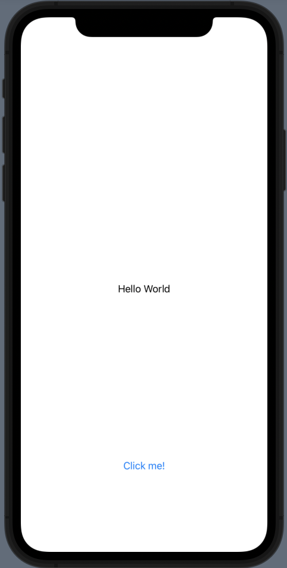

== SwiftUI

=== How to put image in proportional to its parent view?

link:./SwiftUIDemo/SwiftUIDemo/Extension/ImageExtension.swift[ImageExtension.swift]

[source]
----
include::./SwiftUIDemo/SwiftUIDemo/Extension/ImageExtension.swift[lines=2..15]
----

link:./SwiftUIDemo/SwiftUIDemo/ImageView.swift[ImageView.swift]

[source]
----
include::./SwiftUIDemo/SwiftUIDemo/ImageView.swift[lines=4..7]
----

=== How to return different view based on condition as a view?

link:./SwiftUIDemo/SwiftUIDemo/AnyViewDemo.swift[AnyViewDemo.swift]

[source]
----
include::./SwiftUIDemo/SwiftUIDemo/AnyViewDemo.swift[lines=6..16]
----