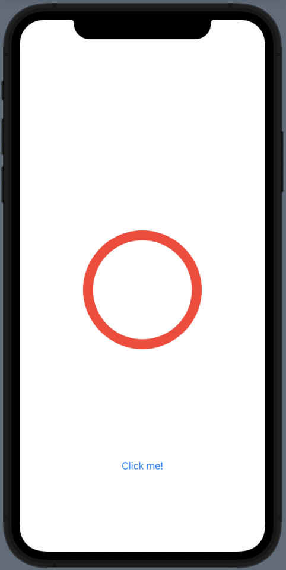
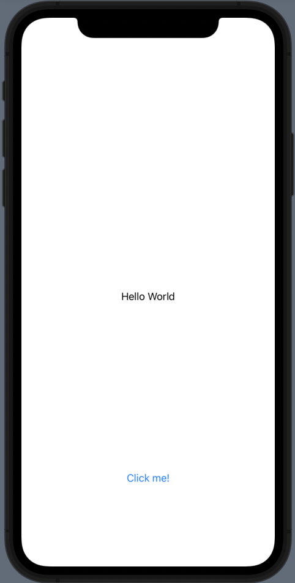

# SwiftUI

## How to put image in proportional to its parent view?

[ImageExtension.swift](./SwiftUIDemo/SwiftUIDemo/Extension/ImageExtension.swift)

``` swift
import SwiftUI

extension Image {
    // proportion: (0, 1]
    func byProportion(proportion: CGFloat, x: Int, y: Int) -> some View {
        GeometryReader { metrics in
            self.resizable()
                // .aspectRatio(contentMode: .fit)
                .aspectRatio(contentMode: .fill)
                .frame(width: metrics.size.width * proportion, height: metrics.size.height * proportion)
                .position(x: metrics.size.width * (CGFloat(x) + 0.5) * proportion, y: metrics.size.height * (CGFloat(y) + 0.5) * proportion)
        }
    }
}
```

[ImageView.swift](./SwiftUIDemo/SwiftUIDemo/ImageView.swift)

``` swift
    var body: some View {
        Image("IMG_1768")
            .byProportion(proportion: 0.2, x: 4, y: 4)
    }
```

## How to return different view based on condition as a view?

 

[AnyViewDemo.swift](./SwiftUIDemo/SwiftUIDemo/AnyViewDemo.swift)

``` swift
    var sampleView: AnyView {
        if flag {
            return AnyView(
                Image(systemName: "circle")
                    .resizable()
                    .foregroundColor(Color.red)
                    .frame(width: 200, height: 200))
        } else {
            return AnyView(Text("Hello World"))
        }
    }
```

## NavigationView/NavigationLink

[NavigationLinkView.swift](./NavigationLinkDemo/NavigationLinkDemo/NavigationLinkView.swift)

``` swift
struct NavigationLinkView: View {

    @State var isActive = false
    @State var isActive2 = false

    var body: some View {
        NavigationView {
            VStack(spacing: 20) {
                
                NavigationLink(destination: AnotherView()) {
                    Text("Click me!")
                }

                
                NavigationLink(destination: AnotherView(), isActive: $isActive) {
                    Button(action: { isActive = true }) {
                        Text("Click me!")
                    }
                }

                
                NavigationLink(destination: AnotherView(), isActive: $isActive2) { EmptyView() }
                Button(action: { isActive2 = true }) {
                    Text("Click me!")
                }
            }
        }
    }
}

struct NavigationLinkView_Previews: PreviewProvider {
    static var previews: some View {
        NavigationLinkView()
    }
}
```

-   Basic way

-   You can set `isActive` programmatically using binding

-   You can hide the navigation link in an empty view and use `isActive`
    for navigation using binding programmatically
