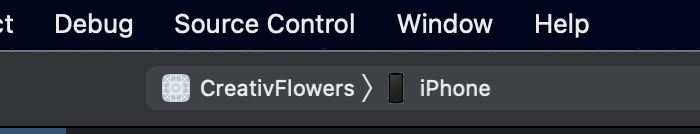
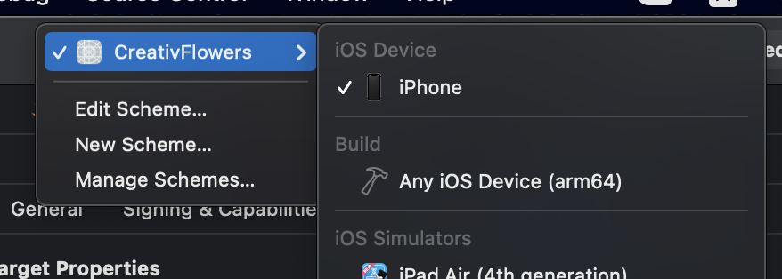
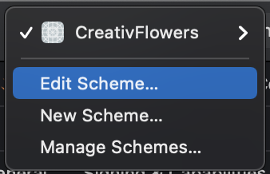
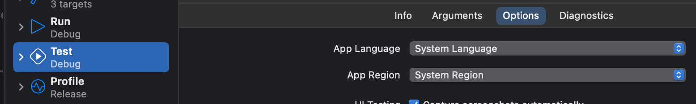
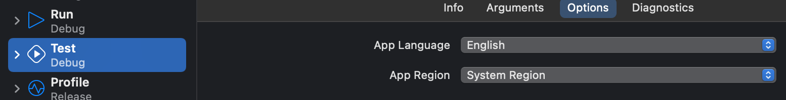

== XCode

=== XCode keyboard shortcut

* Toggle debug area: `Command` + `Shift` + `Y`
* Toggle canvas: `Command` + `Option` + `Return(Enter)`

=== How to change unit test locale?

Click the project name at the left of your simulator.

Click `Edit Scheme` in the drop-down menu,

Change `App Language` to your target language.

Run UI test.
